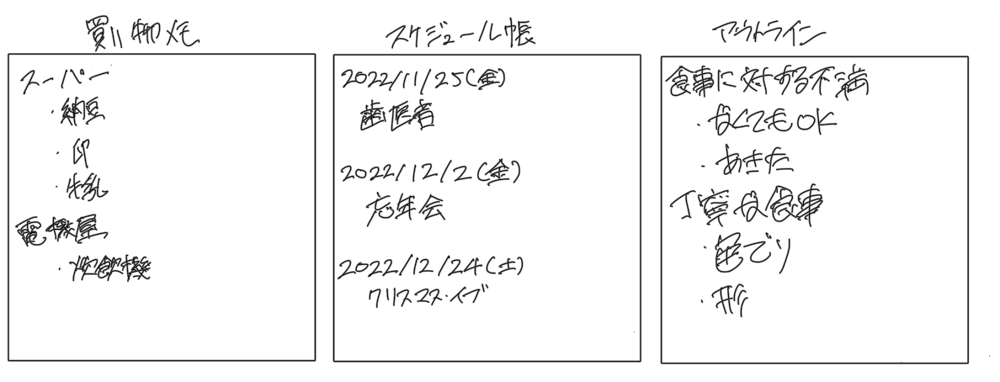

### 要約
ソフトウェア開発は世界の見え方について考える作業だ。

### 世界観の構築
ソフトウェア開発では世界観について考えている事が多い。世界観は独自の用語で、ドメインモデルの構築や名前づけといった呼び方の方が一般的だと思う。

例えば、現実世界の買い物メモは、店の名前ごとに買うものを列挙したものになる。スケジュールや文書のアウトラインも同様に見出し+箇条書きで表現できる。



ただしソフトウェアの世界でのモデルはそれぞれ異なった形になる。例えば買い物メモの場合、店とその内容という形になるだろう。

```
struct Item {
  var name: String
}
struct Shop {
  var name: String
  var items: [Item]
}
struct ShopingMemo {
  var shops: [Shop]
}
```

スケジュール帳の場合は日付と項目の対応になるだろう。

```
struct Item {
  var date: Date
  var title: String
}
struct Schedule {
  var items: [Item]
}
```

文書のアウトラインの場合は木構造となる。

```
struct Item {
  var title: String
  var children: [Item]
}
struct Outline {
  var root: Item
}
```

一方、どの場合でも紙のサイズによる行数制限などは無視する。

### 世界観はなぜ重要か
ソフトウェアは機能拡張や不具合修正を繰り返していく必要がある。「一見簡単な変更に見えるが、実は複雑な変更が必要」という状況は避けたい。

適切な世界観は拡張を自然な形で受け入れる。買い物メモにチェックマークを追加するのも用意だし、文書のアウトラインに孫要素を追加するのも簡単であろう。

また不具合は世界観と実装のズレで発生する。適切な世界観を持っていればコードのやりたいことを把握しやすく、結果として不具合の発見・修正も容易になる。

ちょうどいい世界観はメンテナンス性を高めるためにも重要である。

### 自分を見つめ続ける
適切な世界観は内省し続けることで産まれる。例えば、自分にとってスケジュール帳はどういうものかを考え続けることになる。

- 時刻付きのイベント列なのか、それともカレンダー上に書き込まれた文字列なのか
- 別のタイムゾーンの予定はどう考えているか
- 「毎月25日の給料日」という予定はどう考えているか

さらに技術的な制約も考慮する。スケジュール帳をRDMS上に保存するなら、テーブル定義しやすい構造が求められる。

### 祈り

この作業がソフトウェア開発の中で最も不健康だと思う。自分自身を見つめ続けることは心理的負荷が高い。変なものを選ぶと後々まで苦しむので不安や緊張感もある。深く集中するので、なかなか戻って来れない日もある。

ある程度は経験が頼りになるが、結局はひらめきが必要となる。散歩する、シャワーを浴びる、コーヒーを飲むといった民間信仰はあるが決定的ではないので、祈りに近い気持ちになる。雨乞いのイメージがちらつく。締切が近い場合はヒリつく。

