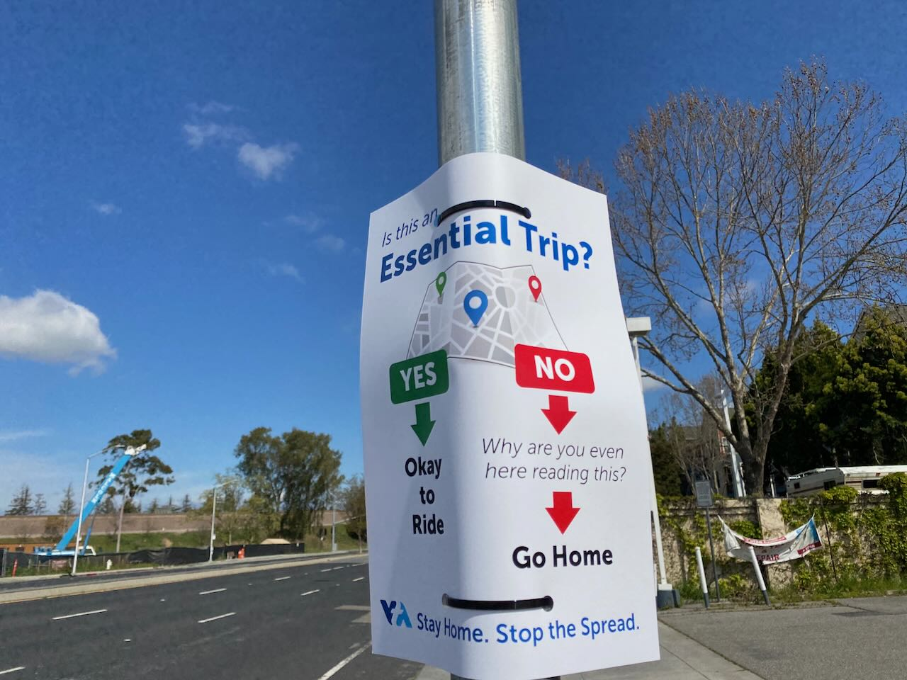

### 要約

COVID-19 による在宅勤務でメンタルが悪化した。

### 在宅勤務の始まり

アメリカに引っ越すと同時に COVID-19 が流行し、在宅勤務となった。これまでにもやったことあるし、余裕だと思っていた。

実際に最初は問題なかった。
少しづつ家具を買って、部屋を充実させていくのは楽しかった。



### 不調の兆し

だんだんといろいろな不調がでてきた。

- 気が滅入る
- いろいろなことに手がつかない
- 夜更かし気味になる
- 昼間眠い
- 食事が適当になる
- 部屋が荒れる

不思議なことに、メンタルが不調な間は上記のことを自覚できない。部屋が散らかっていることは、最近まで認識できてなかった。



### 試行錯誤

さすがにつらいのでいろいろ試した。ほぼ効果がなかった。

- 筋トレ。スクワットできる回数は増えたが、どれも貢献しなかった。
- [重い毛布](https://togetter.com/li/2002855)。気持ちが落ち着くので気にいったが、改善はしなかった。
- 風呂。追い炊き機能がない風呂は長風呂に向かないことを知った。
- [認知シャッフル睡眠法](https://togetter.com/li/1660707)。だんだんと意識が遠のいていくのは実感した。それを自覚してしまうと、うまく寝れなくなった。
- [CBT-I](https://en.wikipedia.org/wiki/Cognitive_behavioral_therapy_for_insomnia)。医者に勧められた。「睡眠時間 ÷ ベッドの上にいる時間」を 1 に近づけると、睡眠の質が改善する。これは実践しきれなかった。

そもそも夜更かし癖に近く、寝たくないと思ってるのに効くわけがない。

少し視点を変えて、部屋の二酸化炭素濃度が高く感じてるのを疑ったので測定してみたが、まったく問題なかった。
気温・湿度も問題なく、西海岸の気候の良さを知った。

医者で薬を処方してもらったが、劇的な効果はない。医療保険の手厚さを知った。

### 原因

リビングのソファーでは比較的よく眠れた。
寝室で仕事していたのが良くなかったのかもしれない。
オフィスまで通う、という儀式が気持ちの切り替えに必要だったのだろう。

そもそもパンデミックからくるストレス自体がひどかった。
よくないニュースが多いし、分からないことも多くて不安になる。

また、診察を通して、ルールも守った生活が極度に苦手なことを自覚した。
不要不急の外出禁止などのが必要な理由は理解しているつもりだが、心が納得するかは別問題らしい。
思い返すと、小学校の生活ルールのようなのも苦手だったし、工場研修でのライン作業・寮生活のときも似た症状になっていた。
それらと違って今度のやつは終わりが見えんぞ、と戦慄した。

### 回復

他にもいろいろ試したが、結局のところ、オフィスが再開して通勤を再開したら、だいぶよくなった。

[最近の食生活](https://text.mzp.jp/article/20221205-cooking/)にも書いたとおり食事もまともにしたし、最近はも部屋も片づいている。
