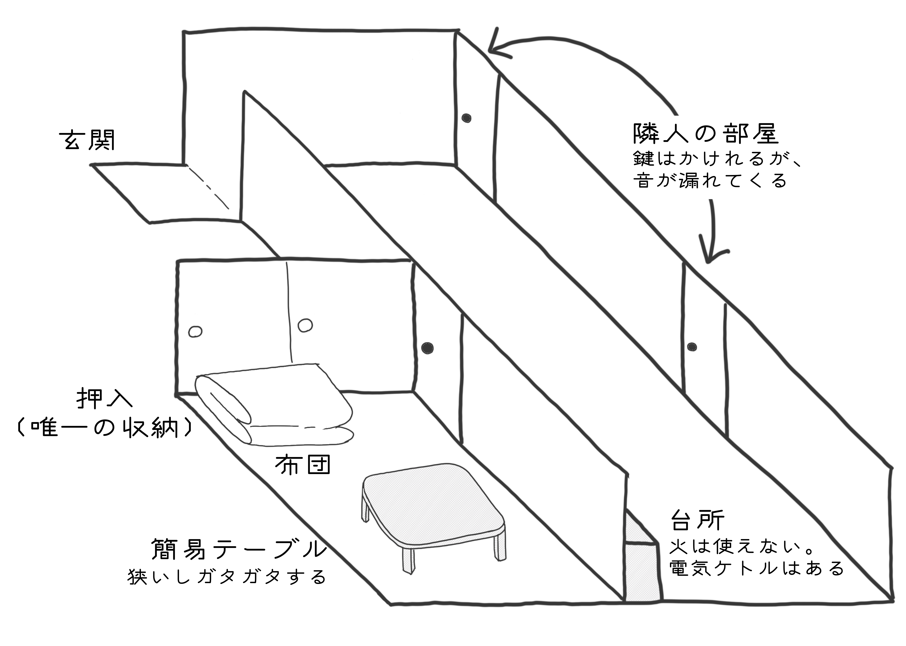
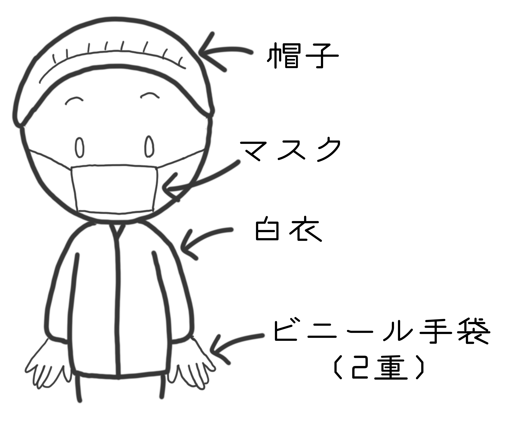
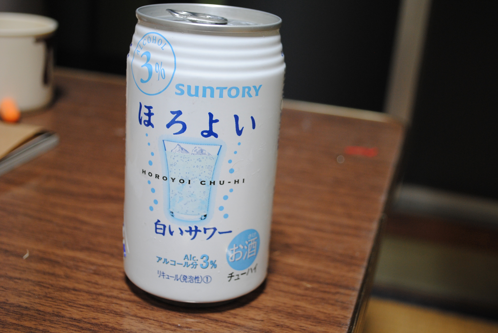

> 工場は監獄みたいな所なのだ - 工場日記(シモーヌ・ヴェイユ)

かつて技術書典で頒布した工場実習の思い出。現実そのままではなく時系列の入れ替えや登場人物の分割や融合をしている。

### 第1週: 工場勤務のはじまり
#### 水曜日
ゴールデンウィーク最終日、憂鬱な気持ちで電車に乗り込んだ。 新卒研修の一環として工場実習に参加するので、工場最寄りの寮に向うのだ。

名古屋駅から電車で2時間、そこから1時間に1本程度しかないバスにゆられること10分、とうとう寮に到着する。
さっそく寮長からいくつかの注意点を伝えられる。

- 3K程度の部屋を3人で共用する。ただし個室には簡易的な鍵が掛けられる。
- 部屋での火気の使用は厳禁。電子レンジと電気ケトルは使用可能。
- 風呂は寮全体で共用。 昼勤者と夜勤者がいるので朝夜それぞれ3時間程度、入浴が可能。
- 食堂が併設されている。朝食、夕食を500円程度で食べられる。外食も可能。

入室すると思ったより狭く、隣人との距離が近いことに驚く。
持参した作業着や私服を押入にしまい、Twitterを見てすごす。
明日からの勤務開始が不安なので早めに寝る。

### 木曜日
起床後、食堂で朝食を食べる。みそ汁がしょっぱい。その後、会社のバスに乗り工場まで移動する。

工場の規則などのオリエンテーションが終わると、いよいよ生産現場へと入る。
高橋さん（仮）という人が教育担当らしい。

これからやる作業を実演してくれる。
細かい手順はあるものの、要は金属製のケースを組付け機にいれてスイッチをいれる作業のようだ。
ケースに回路基盤を接着するための工程らしい。

高橋さんは簡単そうにやっていたが、実際にやると難しい。
組付け機にはいくつかセンサーがついており、そのセンサーに手がひっかかると機械が停止する。
怪我をする心配はなさそうだが、センサーの場所を覚えられず何度も機械を停止させる。

定時に退勤する。 半日ほどしか作業していないが、ぐったりと疲れる。

#### 金曜日
寮の食堂で朝食を取ったのち、出社する。

何度か作業を繰り返すうちに、機械を止める頻度が下がる。生産のペースはあがらず、3時間ほど残業を指示される。
生産目標と現在のペースから何時間残業するかが指示されることに感動を覚える。
これまでは自主的にやる残業しか経験したことがない。

どっと疲れて退勤する。明日は仕事がないことに安心する。

寮にもどったあとは、四畳半神話大系を見る。部屋のサイズが同じせいか、やたら心にしみる。

### 第2週: メンタルクリニック
#### 月曜日
寮の食堂で朝食を取る。全体的にぬるい。おいしくない。
この経験は本当にソフトウェア開発に役立つのかと自問していたら出社時間になった。

数分おきにブザー音がしてびっくりする。
高橋さんによると、場所と通知内容で音の種類が変えられているので、慣れれば自分に関係する音だけに反応できるらしい。
合理的だ。 しかし、慣れていないので、鳴るたびに驚き消耗していく。

寮に戻ったあと読みかけの技術書を開くが、中身が頭に入ってこない。
布団に入っても、なかなか眠れない。

#### 火曜日
朝起きると、人事の田中さん（仮）から「工場実習の調子はどうですか」というメッセージが届いている。
「工場はつらい」と返信する。

先週は小まめに様子を見てくれていた高橋さんが別の工程に移る。
ひとつの工程を覚えるだけでもこんなに大変なのに、複数工程をこなせるのかとビビる。

退勤後、田中さんから電話がかかってくる。 「もうちょっとがんばろう」という結論になり絶望する。

#### 水曜日
寮の食事に期待するのは諦めて、コンビニでおにぎりを買ってくる。火が使えないので選択肢は少ない。

休憩時間にTwitterをしていたら、学生時代のバイトの先輩が寮の近くに住んでいることが分かったので驚く。
退勤後、一緒にご飯を食べにいく。久しぶりにソフトウェア開発の話ができて嬉しい。

#### 木曜日
少し元気がでたので、近所のメンタルクリニックを探す。
平日の18時までが受け付けの所が多かったが、1件だけ土曜日もやっているクリニックを見つける。
次の休みに行くことを決意する。

その後、コンビニのおにぎりを食べて出社。

退勤して寮に戻ってくるが、隣人の生活音が聞こえてきて落ち着かない。
何かを見ながら大笑いしている様子が伝わってくる。

#### 金曜日
高橋さんに「理系の学部でてるなら計算に強いんじゃない」といわれ戸惑う。
話しかけてくれるのはありがたいが、計算は苦手だ。

おにぎりばかり食べるのも限界になってきたので、
30分くらい歩いてラーメン屋にいく。 温かくておいしい。

#### 土曜日
休みになったので、メンタルクリニックに行く。

いくつか聞かれたのち、状況の変化についていけない適応障害の傾向があるといわれる。
定期的な通院と抗うつ作用のあるドグマチールを処方された。

### 第3週: 健康管理
#### 月曜日

いつもどおり作業していると、手に違和感を覚える。
手袋をはずすと、手の皮がべろべろに剥けている。
勤務中は常に白衣と帽子、ビニール手袋を二重でしているので、
汗で皮がふやけてしまって剥けてしまったらしい。

念のため高橋さんに相談すると、あっという間に工場長が様子を見にきた。
対応が早い。

相談した結果、今日は早退して休む、明日までになにか対策を考えておくということになった。
早く帰れることがうれしい。

よい機会なので、寮の付近を散策する。
田舎なのであまり店はないが、雰囲気のいい喫茶店やファミレスを発見する。

#### 火曜日
出社し、今日の作業について聞きにいくと、作業内容が変更になった。
さらに翌週から予定されていた夜勤も取り止めとなり、定時での退勤も増えるらしい。
かろうじて救われた。

作業場所を移り、組付け機への材料の補給を担当することになった。
材料がなくなりそうになるとブザー音が鳴るので、それにあわせて材料を補給する。
機械へ奉仕するような作業に戸惑いを覚えるが、おそらく自動化の難易度と人件費をシビアに比較した結果であろう。
現実的すぎる配置に衝撃を受ける。

退勤後、バスに乗り込んだところ、後ろの席から「もっと残業したいなー」という会話が聞こえて戦慄する。
鉄の心だ。

#### 水曜日
一日中窓のない工場で作業しているので、空が恋しくなる。 青空が見たい。

材料の補給だけでは時間が余るので、別の作業も担当するようになった。
定期的に完成品を抜きだし、強度を検査する作業である。
計測値をPCに打ち込むと正常な値かを判定される。頭を使う必要はない。

寮に戻ると隣人が電話をしている。 部屋の壁が薄いせいで、電話の相手の声まで聞こえる。
驚きしかない。

#### 木曜日
担当作業に材料の前処理が加わった。 金属製のケースを炉にいれて加熱する作業である。 なんのための作業かを高橋さんに聞くと、焼きなまし（アニーリング）だと教えてもらった。
アルゴリズムに焼きなまし法という手法があるので、単語自体は聞いたことがあったが、
自分でやることになるとは思っていなかったので興奮する。

寮に戻ったのち、小説を読む。
肉体労働をしているので楽しめるかと思って「イワンの馬鹿」を読み始めた。
終盤、「頭を使った仕事をするんだ」と主張する悪魔が殺されていた。
作業の単調さがつらくなってきたところなので、ショックを受ける。

#### 金曜日
出社して淡々と作業をこなす。だいぶ慣れてきた。

退勤後、先週と同じラーメン屋に行く。翌日が休みなので、若干テンションがあがっている。

給料日だったので確認しようとするが、オンラインバンキングのメンテナンスとかぶってた。
さらに動揺してPCに水をこぼす。ついてない。

### 第4週: ファミレス生活のはじまり
#### 月曜日

余裕がある日だったのか、高橋さんが工場内を案内してくれる。
部品をつめたケースに内容物を書いたシートが刺さっているのを見つけ「これがカンバンか」と感動する。
ソフトウェア開発の文脈でカンバンの比喩は何度も見たが、実物を見るのははじめてだ。

寮のごはんを食べるのが限界になったので、ファミレスでハンバーグを食べる。
隣人の生活音も聞こえないので心が休まる。
ドリンクバーもあるので長居してしまう。

#### 火曜日
休憩室で、同じく工場実習で来ている伊藤さん（仮）と会う。

夜勤経験済みらしく、やたら勧めてくる。
曰く「人が少なくてゆったりしている」「生産目標にも余裕があってのんびりしている」「深夜なので割増賃金が発生して嬉しい」らしい。
「いわれてもどうしようもないな」と思いながら、あいまいにやりすごす。

退勤後、ふたたびファミレスに行く。
今回はPCを持ち込んで長時間滞在する。
混んでないので許してほしい。

#### 水曜日
おにぎり以外の朝食が食べたかったので、起床後すぐにファミレスに向う。
しかし、早朝営業はしておらず絶望する。
24時間営業ではないファミレスもあるのだと学ぶ。

出社後、高橋さんに「大学ではどういう勉強やってたの」と聞かれ困る。
うまく説明できず数値計算が専門ということになった。

退勤後、ファミレスに行く。 なぜか伊藤さんがいる。 会話する元気はないのでそっと目をそらす。
田舎なので選択肢がなくて店が被るのかと気づく。怖い。

#### 木曜日
退勤後、再びファミレスに行く。 とうとう顔を覚えられ、禁煙席か喫煙席かの希望を聞かれなくなった。
変なニックネームをつけられていないか心配になる。

いつものメニューに飽きたので、頼んだことのないハンバーガーにする。
やたらおいしくて感動する。

#### 金曜日
いつもと違い、過去の検査データをExcelに入力する作業をする。
作業着を来て、立ちながらExcelを使ったことはないので、若干戸惑う。
しかし、これまでと違う作業であることに心が踊る。

退勤後はラーメンを食べにいく。
習慣化した。

### 第5週: 救いを求める
#### 月曜日
気力がなくなってきたので、毎朝ヒゲを剃るのをあきらめる。
工場では常にマスクをつけているので、いいかなと思った。

印刷したまま読んでなかった論文を読みはじめる。
学生時代に近いことをして、少しでも現状に抗おうとする。
寮の部屋には椅子がないので苦労するが、がんばって読む。

#### 火曜日
朝おきると布団が真っ黒に染まっている。
枕元にあったボールペンからインクが漏れたらしい。
寮長の所へ謝りに行くと「黙って洗濯に出せばいいよ。正直だね」といわれ、新しいシーツをもらう。心が広い。

論文を持ち込み休憩時間に読む。
英語の勉強をしていると勘違いされたが、面倒なのでそういうことにする。

#### 水曜日

今日は定時後に交通安全に関する講習がある。
業務外で拘束されることは不満だが、講習が終われば帰れるのは安心感がある。

退勤したのち、ファミレスに行く。
帰る途中、コンビニで酎ハイを買う。飲むと楽しくなれると気づく。

#### 木曜日
淡々と手を動かしながら、定時を待つ。
何度腕時計を見ても時間が進んでいない。時間の経過がゆっくりだ。

頭を使わないので他のことを考えられるかと思いきや、そうでもない。
作業になれてないせいなのか、精神が消耗しているせいなのか。

#### 金曜日
習慣化したラーメン屋に向う。
途中のコンビニで酎ハイを買い、飲みながら向かう。
ほろ酔いで見る街灯はきれいだ。

ほろ酔いのせいかいつもよりラーメンがおいしく感じる。
ついTwitterに「どんなときでもラーメンはおいしい」とつぶやく。

### 第6週: 野菜を求めて
#### 月曜日
iPhoneの充電ケーブルをなくしたことに気づく。どこかでなくしたらしい。
隣人に貸してもらう。ありがたい。いつもうるさいと思っていることを少し反省する。

退勤後、ファミレスに行く。
野菜を食べたいのでサラダバーをつけるが満たされない。
火を通した野菜が食べたい。野菜炒めが食べたい。

#### 火曜日
休憩時間に伊藤さんと会う。
野菜が食べたいという相談をすると、ポトフを勧められる。 野菜を丸ごと煮れば作れるという手軽さがいいといわれる。
しかし寮で火は使えないので、どうしようもない。

退勤後、ファミレスに行く。
和定食を選び、野菜が多めの小鉢をつける。煮物やおひたしがうまい。
しかし小鉢なので、いまひとつ満たされない。

#### 水曜日
休憩時間しかトイレに行けない生活が嫌になる。
トイレには好きなときに行きたい。

退勤後、ファミレスに行く。
タケノコご飯を選ぶ。
こりこりしておいしい。

#### 木曜日
とうとう工場の昼食に飽きる。 揚げ物しかでないのがつらい。

退勤後、ファミレスに行く。
チゲ鍋を選んだところ、大量のもやしが入ってでてきた。
これだ、これだよ、と思いながら噛みしめる。

#### 金曜日
週末なのでラーメンを食べにいく。野菜のトッピングを増やす。

寮に戻ると同室の住人がどこかにでかけている。 誰もいないので、ひさしぶりに静かな空間を堪能する。

#### 土曜日
工場実習の歓迎会としてバーベキューが開かれる。
土曜日に実施するのは、昼勤の人と夜勤の人の予定が唯一合う曜日だかららしい。

ひたすら野菜を焼いて食べる。おいしい。

### 第7週: 工場勤務のおわり
#### 月曜日
人事の田中さんから今週で工場実習は終わりだというメッセージが届く。
予定より延長される年もあるというウワサが流れていたので、安心する。

工場実習を通じて学んだことをレポートにまとめる必要があるので書きはじめる。
レポートには「とても貴重な経験をした。この経験が直接ソフトウェア開発に役に立つことはないだろうが、学んだ精神はきっと役に立つ」と書いた。
つらい思いをしたことはざっくりと割愛した。

#### 火曜日
退寮に向けた準備をはじめる。服の洗濯タイミングに迷う。
案の定、枚数のカウントをミスり、半裸で洗濯物を干す。

#### 水曜日
田中さんから、工場実習を終える前に改善提案しろといわれてたことを思いだす。
散々悩んだ結果、材料の投入口に注意事項を書いたテープを貼ることを思いつく。
こうやって工場内の注意書きは増えていくんだろうなと感じる。

高橋さんに相談したらテプラを準備してくれた。 本当にフットワークが軽い。

#### 木曜日
食堂で伊藤さんと会う。書いたレポートをお互いに見せあう。
文章の構成を見るためにぱらぱら眺めていたら、ちゃんと見ていないと思われ怒られる。 誤解だ。

#### 金曜日
出社すると、高橋さんに「今日で最後なので定時であがって帰るといいよ」といわれる。 定時で帰れることが保証されると本当に安心する。

定時になったのち、高橋さんや班長に挨拶して工場を後にする。
「一番いい笑顔してるね」とからかわれる。

寮にもどり荷物を持って駅に向う。「次、工場実習をすることになったら、即座に退職しよう」と決心しながら名古屋駅に戻っていった。

### その後
工場実習が終了したのち、メンタルは回復し、服薬や通院の必要はなくなった。 文字とおり病的なまでに合わなかったらしい。
ただ工場夜景が見れなくなる、工場見学に行けなくなるなどの症状が年単位で継続した。

時間が経過したことと、この会社を退職したことから、平静をもって向き合えるようになった。
あらためて工場という合理化されたシステムはすばらしく、中で働く人の優しさをやっと感じることができた。
